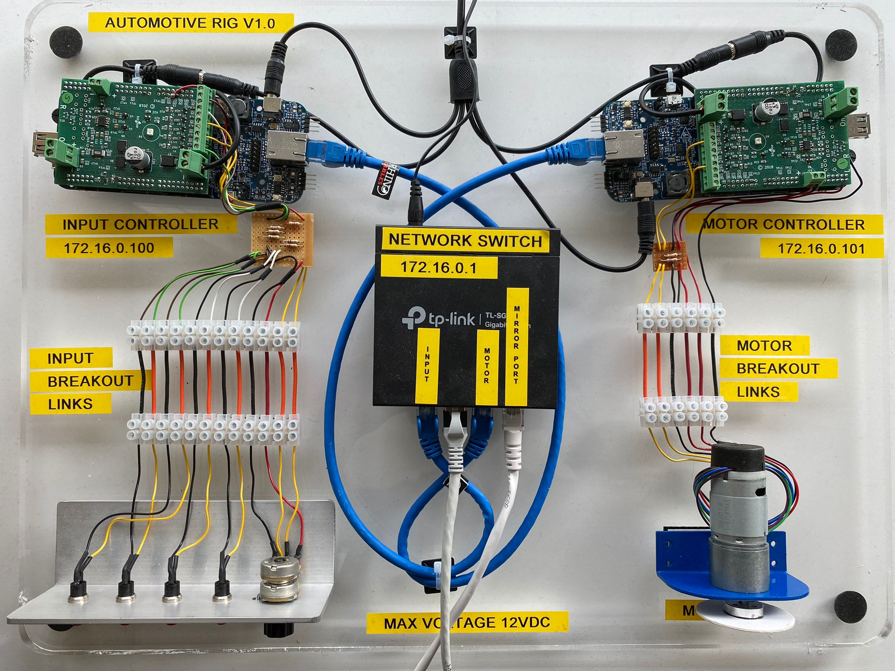

<h1 align="center">
  <br>
    </a>
  <br>
    Automotive Cybersecurity
  <br>
</h1>

<h4 align="center">A Framework for Detection of Anomalies in Sensor Data for Prevention of Cyberattacks in Connected Autonomous Vehicles written in Python.</h4>

<p align="center">
  <a href="#Features">Features</a> |
  <a href="#Overview">Overview</a> |
  <a href="#Usage">Usage</a>       |
  <a href="#License">License</a>   
</p>

# Features
- Data collection and feature extraction layers
- Supervised machine learning algorithm implementation
- Test driven development (unit tests, integrations tests)
- Link to [official documentation](./docs/thesis.pdf)

# Overview
Advances in sensor and communication technology have had a significant impact on our daily lives, and transportation is no exception. In today’s major cities, where conventional transport systems have become overburdened and inefficient, there is a strong motivation for the development and implementation of intelligent transport systems, with increased levels of interoperability, connectivity and networking and automation. Whilst the increased connectivity can be a good thing, such networks of devices are susceptible to an increased risk of a cyber attack. Furthermore, increased automation would decrease the likelihood that an adversary is detected during execution of the attack.
The main aim of this project is to assess the suitability of a Pattern of Life inspired network monitoring system in the early detection of a denial of service (DoS) attack performed on in-vehicle networks. The hypothesis to be tested is that early indicators of an attack can be detected by analysing patterns in the data sent over the network with the help of supervised learning algorithms. A hardware demonstrator of automotive grade was provided by Thales Group to accomplish this. It provides an abstraction to the shared network and components one would expect to find in a real automobile. Pattern of life has been used in other industries, mainly military and maritime, but no such PoL implementation exists in an automotive cybersecurity. This project aims to contribute to this gap in the industry. There are two main aspects to this project, a software development component and a research component, with the aims being as follows:
1. The first, software development component, will aim to build a data collection and feature extraction tool to extract information and features from the hardware demonstrator
2. The second, research component, will aim to assess the effectiveness of a PoL inspired network monitoring system in an automotive cyber security context for the detection of a DoS attack and evaluate the performance of supervised machine learning algorithms using suitable statistical metrics.

The contributions of the project are:
1. Performed a literature review which summarises the key findings of Pattern of Life studies, on which literature is not very readily available.
2. Proposed a Pattern of Life processing framework in the context of automotive cyber security, with the aim of detection of DoS attacks.
3. Development of data collection and feature extraction tools that can be used by future users of the hardware demonstrator for their research pursuits.
4. The dataset generated during data collection of baseline operation of the board and for all DoS attacks can be used by the online community to apply their own ML techniques and is available online in this repository.
5. The hypothesis that a DoS attack can be detected by using a carefully chosen feature vector of protocol throughputs was proven to be true by training a supervised [binary classifier](https://en.wikipedia.org/wiki/Binary_classification) capable of predicting this.

# Usage
## Setup
This sections contains all of the hardware and software pre-requisites to get you started with the files in this repository.
### Hardware
The developed software interfaces with this hardware from [Thales](https://www.thalesgroup.com/en). The hardwares provides an abstraction to what one might find in a vehicular network.

<p align="center">
    
</p>

### Software
- Ensure you have [Wireshark](https://www.wireshark.org) installed.
- Ensure that you [tshark](https://tshark.dev/setup/install/) installed.
- Ensure that you have [Python](https://www.python.org) installed.
- Set up a virtual environment using [venv](https://virtualenv.pypa.io/en/latest/) and install the required dependencies using the provided [requirements.txt](./requirements.txt).

## Scripts
- [`attack.py`](./attack.py) - the script used to perform a DoS attack on the hardware demonstrator. To perform this attack, the user needs to first connect a device to a free port on the switch, set itself a static IP, and then invoke the script from the terminal using a python interpreter. An example would be: 
   ```bash
   python3 attack.py
   ```
- [`collect.py`](./collect.py) - reads in packet information from a .pcapng that has been captured by tshark, and outputs a CSV containing a time series of sniffed packets.
- [`feature.py`](./feature.py) - aggregates features from the time series of packets from `collect.py`, and outputs a CSV containing these features.
- [`plot.py`](./plot.py) - plots the monitored network activity.
- [`automate.py`](./automate.py) - automates the collect, feature and plot modules.
- [`testing.py`](./testing.py) - performs the unit tests, using the files stored in [`06_testing`](./06_testing).
- [`train.py`](./train.py) - script used to evaluate the performance of the binary classifers on the training and testing sets.
- [`pol_utilities.py`](./pol_utilities.py) - helper methods for all of the modules.

## Training Files
- [`00_raw`](./00_raw) - contains capture files from tshark in `.pcapng` format.
- [`01_collect`](./01_collect) - information from the capture files from `00_raw` is cleaned and saved in this folder as a time series of packets as a CSV file.
- [`02_feature`](./02_features) - information from the CSV files from `01_collect` is aggregated and saved as a time series of features in this folder as a CSV. Example features include network throughputs, vehicle speed, throttle demand, brake status, cruise control.
- [`03_train`](./03_train) - contains the baseline data and attack data used for training the binary classifier.
- [`05_plot`](./05_plots) - contains all of the plots of the colllected baseline and attack data.

## Validation Files
- [`07_live_raw`](./07_live_raw) - contains the capture files of the DoS attacks performed at different rates (0.1s -0.5s)
- [`08_live_collect`](./08_live_collect) - contains the cleaned capture files from `07_live_raw` as a CSV file.
- [`09_live_features`](./09_live_features) - aggregated features of the files from `08_live_collect`.
- [`10_live_throuhgputs`](./10_live_throughputs) - contains the throughputs (features) used to test the binary classifier.
- [`11_live_plot`](./11_live_plot) - contains plots of network activity of validation set DoS attacks.

# License

```
Copyright (c) 2021 Keane Fernandes

Permission is hereby granted, free of charge, to any person obtaining a copy
of this software and associated documentation files (the "Software"), to deal
in the Software without restriction, including without limitation the rights
to use, copy, modify, merge, publish, distribute, sublicense, and/or sell
copies of the Software, and to permit persons to whom the Software is
furnished to do so, subject to the following conditions:

The above copyright notice and this permission notice shall be included in all
copies or substantial portions of the Software.

THE SOFTWARE IS PROVIDED "AS IS", WITHOUT WARRANTY OF ANY KIND, EXPRESS OR
IMPLIED, INCLUDING BUT NOT LIMITED TO THE WARRANTIES OF MERCHANTABILITY,
FITNESS FOR A PARTICULAR PURPOSE AND NONINFRINGEMENT. IN NO EVENT SHALL THE
AUTHORS OR COPYRIGHT HOLDERS BE LIABLE FOR ANY CLAIM, DAMAGES OR OTHER
LIABILITY, WHETHER IN AN ACTION OF CONTRACT, TORT OR OTHERWISE, ARISING FROM,
OUT OF OR IN CONNECTION WITH THE SOFTWARE OR THE USE OR OTHER DEALINGS IN THE
SOFTWARE.
```
